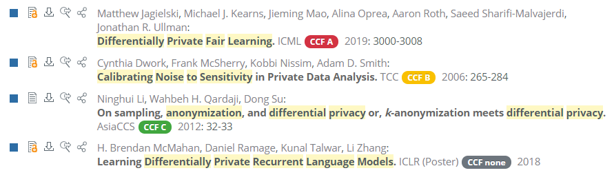
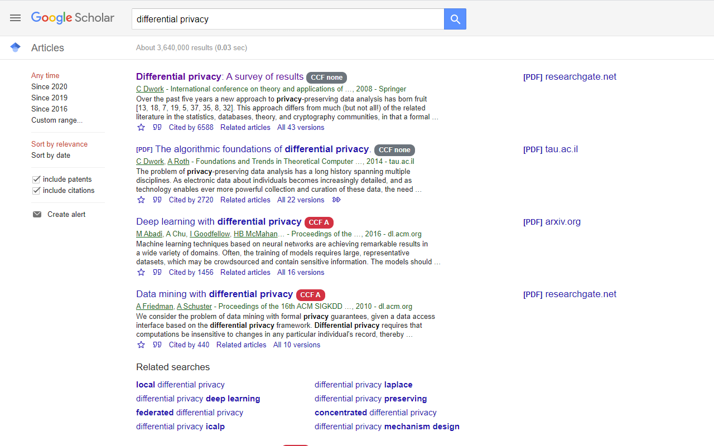
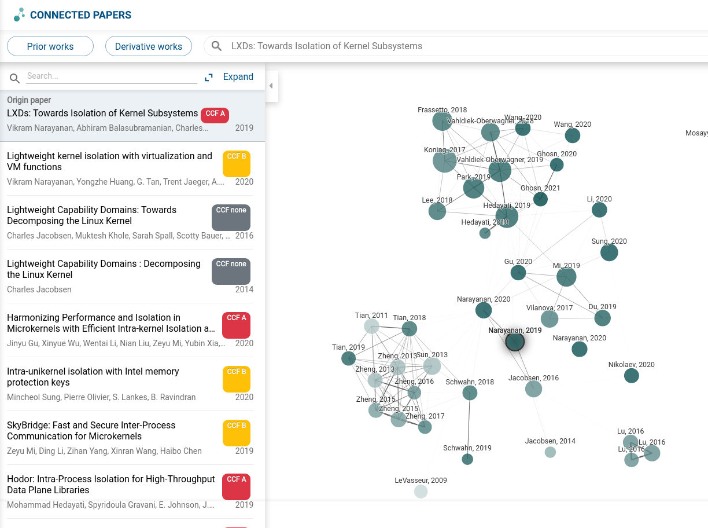
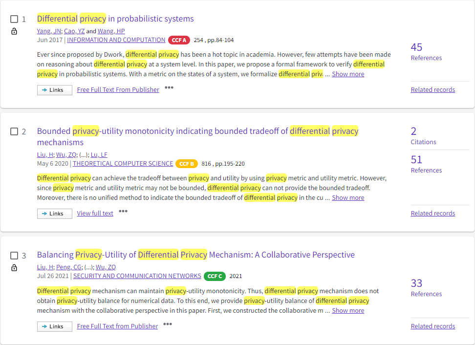
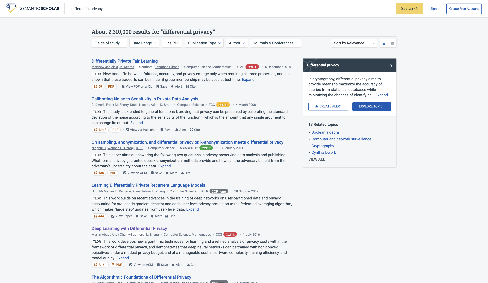
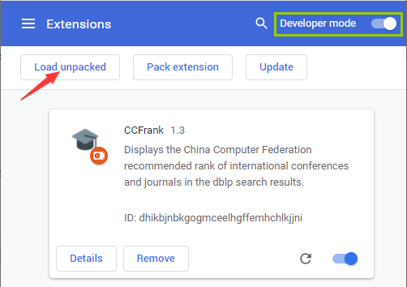

<h1 align="center"> CCFrank</h1>

    
    
    
    
    
    
    

The Chrome Extension, Firefox and Edge Add-on display the China Computer Federation recommended rank of international
conferences and journals in the dblp, Google Scholar, Connected Papers, Semantic Scholar and Web of Science search results.

Chrome 扩展程序、Firefox 和 Edge 附加组件，在 dblp、Google 学术、Connected Papers、Semantic Scholar 和 Web of Science 的搜索结果中显示中国计算机学会推荐的国际会议和期刊排名。

## Preview

:warning: Please refresh the page if the CCF ranks don't show up on [Connected Papers](https://www.connectedpapers.com/)
.

## Install

Directly install from the Chrome, Firefox or Microsoft Edge Add-ons Store (Recommended) _or_ load from the source.

### Install from the Chrome / Firefox / Microsoft Edge Add-ons Store

1. Find the CCFrank extension
   in [Chrome Web Store](https://chrome.google.com/webstore/detail/ccfrank/pfcajmbenomfbjnbjhgbnbdjmiklnkie)
   / [Firefox Bowser Add-ons](https://addons.mozilla.org/zh-CN/firefox/addon/ccfrank/)
   / [Microsoft Edge Add-ons Store](https://microsoftedge.microsoft.com/addons/detail/ccfrank/pboigbpepikdoeindehghnpojjblhjmm)
   .
2. Click the `Add to Browser` button.
3. CCFrank needs to read and change dblp, Google Scholar, Connected Papers and its mirror sites. To approve,
   click `Add extension`.

### Load Unpacked

Clone CCFrank to a directory.

1. Open the Extension Management page by navigating to `chrome://extensions`.

    - The Extension Management page can also be opened by clicking on the Chrome menu, hovering over **More Tools** then
      selecting **Extensions**.

2. Enable Developer Mode by clicking the toggle switch next to **Developer mode**.

3. Click the **LOAD UNPACKED** button and select the directory holding CCFrank.

## What's New

**Version 4.3.1**

> Mar 6, 2023

1. 感谢 @sdtsztom 指正，修复了 dblp 中 HPCA 地址的错误。

**Version 4.3.0**

> Dec 13, 2022

1. 感谢 @ViTsing 提醒，调整到《[中国计算机学会推荐国际学术会议和期刊目录](https://www.ccf.org.cn/Academic_Evaluation/By_category/)》2022年拟定版（2022 年 12 月）。

**Version 4.2.3**

> Dec 11, 2022

1. 感谢 @FlyingFog 修复了 OOPSLA 地址的错误。
2. 感谢 @FlyingFog 扩充了 tag 显示逻辑。

**Version 4.2.2**

> Jun 30, 2022

1. 感谢 @FunClip 修复了对 Web of Science 的支持。

**Version 4.2.1**

> Dec 26, 2021 

1. 增加了对 Semantic Scholar 上 CCF 期刊的支持。

**Version 4.2.0**

> Dec 18, 2021

1. 增加了对 Semantic Scholar 上 CCF 会议的支持。 

**Version Unchanged**

> Oct 26, 2021

1. New branch "mv2-firefox" for downgrading to Manifest V2. Mozilla Add-ons "are hoping to complete enough work on this
   project to support developer testing in Q4 2021 and start accepting v3 submissions in early 2022. This schedule may
   be pushed back or delayed due to unforeseeable circumstances."
   See [Manifest v3 update](https://blog.mozilla.org/addons/2021/05/27/manifest-v3-update/).

**Version 4.1.2**

> Oct 24, 2021

1. 修复了 dblp 中 AsiaCCS 2021 地址的错误。

**Version 4.1.1**

> Oct 20, 2021

1. The description translation in locale en exceeds maximum size limit of 132 characters.

**Version 4.1.0**

> Oct 20, 2021

1. 增加了对 Web of Science 的支持。

**Version 4.0.1**

> Oct 10, 2021

1. Migrate to Manifest V3.

**:tada: Published**

> Aug 30, 2021

CCFrank
在 [Microsoft Edge 扩展商店](https://microsoftedge.microsoft.com/addons/detail/ccfrank/pboigbpepikdoeindehghnpojjblhjmm)上架~

**Version 4.0.0**

> Aug 24, 2021

1. 感谢 @purplewall1206 增加了对 Connected Papers 的支持。

**Version 3.2.5**

> Aug 16, 2021

1. 修复了 Google Scholar 文章标题预处理的错误。

**Version 3.2.4**

> Aug 12, 2021

1. 感谢 @Fanchao-Qi 的指正，修复了与 CatalyzeX 插件同时开启时重复 tag 的错误。

**Version 3.2.3**

> Jul 18, 2021

1. 感谢 @zshhans 的帮助，修复了 XHR not working on Firefox 的错误。

**:tada: Daily Users**

> Jun 18, 2021

Total current users: 1,006

**Version 3.1.3**

> Apr 12, 2021

1. 修复了 Google 学术首条搜索结果的 Tooltip 显示被覆盖的错误。

**Version 3.1.2**

> Mar 1, 2021

1. 感谢 @zhuye88 的帮助，修复了《目录》中“Pattern Recognition”地址的错误。

**Version 3.1.1**

> Dec 20, 2020

1. 感谢 @ifzh 和 @linwhitehat 的帮助，修复了由“会议/期刊的URL重复”引起的错误。

**Version 3.0.3**

> Dec 16, 2020

1. 放宽了 Google 学术的匹配条件，修复了由“发表年份”不匹配引起的错误。

**Version 3.0.2**

> Dec 16, 2020

1. 更正了 VLDB 会议的网址。

**Version 3.0.1**

> Dec 15, 2020

1. 修复了由标题中包含“特殊字符”引起的错误。

**Version 3.0.0**

> Dec 13, 2020

1. 增加了对 Google Scholar 的支持，建议更新到此版本。

**Version 2.0.0**

> Dec 10, 2020

1. 全新的匹配规则，即“全称/简称匹配”->“网址匹配”。
2. 感谢 @realstolz 指正，新版本已规避由“区分大小写”引起的错误。

**:tada: Published**

> Dec 9, 2020

CCFrank 在 [Firefox 附加组件工坊](https://addons.mozilla.org/zh-CN/firefox/addon/ccfrank/)上架~

> Nov 6, 2020

CCFrank 在 [Chrome 网上应用店](https://chrome.google.com/webstore/detail/ccfrank/pfcajmbenomfbjnbjhgbnbdjmiklnkie)发布~

**Version 1.3.2**

> Nov 3, 2020

1. 感谢 @kevyn-zhang 指正，修正了 Software: Practice and Experience (SPE) 等由“连字符”引起的错误。

**Version 1.3.1**

> Nov 3, 2020

1. 增加了 dblp 使用 AJAX 更新搜索结果（即 URL 无 "/search?q=" 关键词）时的支持。

**Version 1.3**

> Oct 29, 2020

1. 增加了 dblp person、DB/Conferences and Workshops 和 DB/Journals 网页的支持；
2. 重构了代码。

**Version 1.2**

> Oct 28, 2020

1. 适配 dblp 刊物名称；
2. 增加了 dblp computer science bibliography 的镜像站点支持；
3. 专注优化 dblp 支持。

**Version 1.1**

> Nov 15, 2019

1. 适配 dblp "2019-11-11: Open citation data and dblp" [Feature Spotlight]。

**Version 1.0**

> Aug 28, 2019

1. 优化了 dblp 上会议和刊物名称的匹配规则；
2. 修正了错误，更新到《[中国计算机学会推荐国际学术会议和期刊目录](https://www.ccf.org.cn/Academic_Evaluation/By_category/)》第五版（2019 年 4 月）。

## Contributors ✨

Thanks goes to these wonderful people ([emoji key](https://allcontributors.org/docs/en/emoji-key)):

<!-- ALL-CONTRIBUTORS-LIST:START - Do not remove or modify this section -->
<!-- prettier-ignore-start -->
<!-- markdownlint-disable -->
<table>
  <tbody>
    <tr>
      <td align="center" valign="top" width="14.28%"><a href="https://scholar.google.com/citations?user=a8sqKFkAAAAJ"> <b>wyliu</b></a> <a href="#ideas-WenyanLiu" title="Ideas, Planning, & Feedback">🤔</a> <a href="https://github.com/WenyanLiu/CCFrank4dblp/commits?author=WenyanLiu" title="Code">💻</a> <a href="#data-WenyanLiu" title="Data">🔣</a> <a href="https://github.com/WenyanLiu/CCFrank4dblp/commits?author=WenyanLiu" title="Documentation">📖</a> <a href="#maintenance-WenyanLiu" title="Maintenance">🚧</a></td>
      <td align="center" valign="top" width="14.28%"><a href="https://github.com/kevyn-zhang"> <b>kevyn-zhang</b></a> <a href="https://github.com/WenyanLiu/CCFrank4dblp/issues?q=author%3Akevyn-zhang" title="Bug reports">🐛</a></td>
      <td align="center" valign="top" width="14.28%"><a href="http://ipads.se.sjtu.edu.cn/rong_chen"> <b>Rong Chen</b></a> <a href="https://github.com/WenyanLiu/CCFrank4dblp/issues?q=author%3Arealstolz" title="Bug reports">🐛</a></td>
      <td align="center" valign="top" width="14.28%"><a href="http://jwa.ng"> <b>Junwei Wang</b></a> <a href="#platform-junwei-wang" title="Packaging/porting to new platform">📦</a></td>
      <td align="center" valign="top" width="14.28%"><a href="https://github.com/ifzh"> <b>iFzh</b></a> <a href="https://github.com/WenyanLiu/CCFrank4dblp/issues?q=author%3Aifzh" title="Bug reports">🐛</a> <a href="#ideas-ifzh" title="Ideas, Planning, & Feedback">🤔</a></td>
      <td align="center" valign="top" width="14.28%"><a href="https://linwhitehat.github.io/"> <b>lin</b></a> <a href="#ideas-linwhitehat" title="Ideas, Planning, & Feedback">🤔</a> <a href="https://github.com/WenyanLiu/CCFrank4dblp/issues?q=author%3Alinwhitehat" title="Bug reports">🐛</a></td>
      <td align="center" valign="top" width="14.28%"><a href="http://www.yezhu.com.au/"> <b>YE ZHU</b></a> <a href="https://github.com/WenyanLiu/CCFrank4dblp/issues?q=author%3Azhuye88" title="Bug reports">🐛</a></td>
    </tr>
    <tr>
      <td align="center" valign="top" width="14.28%"><a href="https://github.com/zshhans"> <b>zshhans</b></a> <a href="https://github.com/WenyanLiu/CCFrank4dblp/issues?q=author%3Azshhans" title="Bug reports">🐛</a> <a href="https://github.com/WenyanLiu/CCFrank4dblp/commits?author=zshhans" title="Code">💻</a></td>
      <td align="center" valign="top" width="14.28%"><a href="https://github.com/Fanchao-Qi"> <b>Fanchao Qi</b></a> <a href="https://github.com/WenyanLiu/CCFrank4dblp/issues?q=author%3AFanchao-Qi" title="Bug reports">🐛</a></td>
      <td align="center" valign="top" width="14.28%"><a href="http://www.zi-c.wang"> <b>ppw</b></a> <a href="https://github.com/WenyanLiu/CCFrank4dblp/commits?author=purplewall1206" title="Code">💻</a> <a href="#platform-purplewall1206" title="Packaging/porting to new platform">📦</a> <a href="https://github.com/WenyanLiu/CCFrank4dblp/issues?q=author%3Apurplewall1206" title="Bug reports">🐛</a></td>
      <td align="center" valign="top" width="14.28%"><a href="https://www.neardws.com"> <b>Near</b></a> <a href="#platform-neardws" title="Packaging/porting to new platform">📦</a></td>
      <td align="center" valign="top" width="14.28%"><a href="http://bo233.github.io"> <b>bo233</b></a> <a href="#platform-bo233" title="Packaging/porting to new platform">📦</a></td>
      <td align="center" valign="top" width="14.28%"><a href="https://github.com/FunClip"> <b>Kai Chen</b></a> <a href="https://github.com/WenyanLiu/CCFrank4dblp/commits?author=FunClip" title="Code">💻</a> <a href="#maintenance-FunClip" title="Maintenance">🚧</a> <a href="https://github.com/WenyanLiu/CCFrank4dblp/issues?q=author%3AFunClip" title="Bug reports">🐛</a></td>
      <td align="center" valign="top" width="14.28%"><a href="https://github.com/996787373"> <b>Time machine</b></a> <a href="#maintenance-996787373" title="Maintenance">🚧</a> <a href="https://github.com/WenyanLiu/CCFrank4dblp/pulls?q=is%3Apr+reviewed-by%3A996787373" title="Reviewed Pull Requests">👀</a></td>
    </tr>
    <tr>
      <td align="center" valign="top" width="14.28%"><a href="https://github.com/FlyingFog"> <b>FlyingFog</b></a> <a href="https://github.com/WenyanLiu/CCFrank4dblp/commits?author=FlyingFog" title="Code">💻</a> <a href="https://github.com/WenyanLiu/CCFrank4dblp/issues?q=author%3AFlyingFog" title="Bug reports">🐛</a> <a href="#data-FlyingFog" title="Data">🔣</a></td>
      <td align="center" valign="top" width="14.28%"><a href="https://github.com/ViTsing"> <b>ViTsing</b></a> <a href="#data-ViTsing" title="Data">🔣</a></td>
      <td align="center" valign="top" width="14.28%"><a href="https://github.com/sdtsztom"> <b>Tang</b></a> <a href="#data-sdtsztom" title="Data">🔣</a></td>
    </tr>
  </tbody>
</table>

<!-- markdownlint-restore -->
<!-- prettier-ignore-end -->

<!-- ALL-CONTRIBUTORS-LIST:END -->

This project follows the [all-contributors](https://github.com/all-contributors/all-contributors) specification.
Contributions of any kind welcome!

## Reports

- Nov 3, 2020 (Nov 7, 2021). [m1llie](https://github.com/m1-llie)
  , [绝对领域小摩托](https://www.zhihu.com/people/m1llieee): [高效搜集论文指北](https://m1llie.tech/archives/searchpaper.html)
  , [高效搜集论文指北](https://zhuanlan.zhihu.com/p/430411403).
- Dec 7, 2020. 安全学术圈: [CCFrank：DBLP论文等级助手插件](https://mp.weixin.qq.com/s/LXVp25dB-f41l2gnWx0Yog).
- Apr 18, 2021. [黑米亚](https://blog.csdn.net/weixin_39798910): [【导航链接】计算机科研学习](https://blog.csdn.net/weixin_39798910/article/details/115821356).
- Apr 23, 2021. [Buffer](https://www.zhihu.com/people/buffer-3): [科研论文检索方法入门（计算机领域）](https://zhuanlan.zhihu.com/p/367339390).
- Jun 15, 2021. [etamsylate-pupu](https://github.com/etamsylate-pupu): [文献阅读技巧](https://redamancy.tech/archives/25/).
- Jul 19, 2021. [Lil Ning](https://www.zhihu.com/people/evanism101): [深度学习方向科研工作的神器](https://zhuanlan.zhihu.com/p/388558877).
- Oct 14, 2021. [爱可可-爱生活](https://weibo.com/u/1402400261): [CCFrank](https://m.weibo.cn/status/4692180050905247).
- Oct 21, 2021. [Wenhao Yang](https://github.com/Alpha-Yang)：[保研工具推荐-快速查询导师论文发表情况](https://github.com/Alpha-Yang/CS-BAOYAN-2022/blob/eb1d092a99fb62fd080db82da66cdf37d7060d0b/%E5%AF%BC%E5%B8%88%E6%8E%A8%E8%8D%90/%E4%BF%9D%E7%A0%94%E5%B7%A5%E5%85%B7%E6%8E%A8%E8%8D%90-%E5%BF%AB%E9%80%9F%E6%9F%A5%E8%AF%A2%E5%AF%BC%E5%B8%88%E8%AE%BA%E6%96%87%E5%8F%91%E8%A1%A8%E6%83%85%E5%86%B5.md).

## More Awesome Scripts

- [ hnshhslsh/show-rank](https://github.com/hnshhslsh/show-rank)
  - 支持在 Chrome 中的 ACM Digital Library、dblp、IEEE Xplore 和 Springer
  显示中国计算机学会推荐的国际会议和期刊排名（很开心自己在谷歌学术上的查询方法被[直接使用](https://github.com/hnshhslsh/show-rank/commit/864b7a8d2896707e19281ed6e21518eb35cda1db)啦:clap:）；
- [ Nixiak-nan/swufe_ccf_show_ranking](https://web.archive.org/web/20220118103343/https://github.com/Nixiak-nan/easyScholar/tree/0551c6dcecd70dbc08b580fbce0df43563ebe90c)
  - 支持在 Chrome 和 Firefox 中的 百度学术、知网、Google Scholar、IEEExplore、Microsoft Academic、Springer、Web of Science
  显示西南财经大学学术期刊目录（Github 果然是大型交友平台，和开发同学已成为好友啦）。
